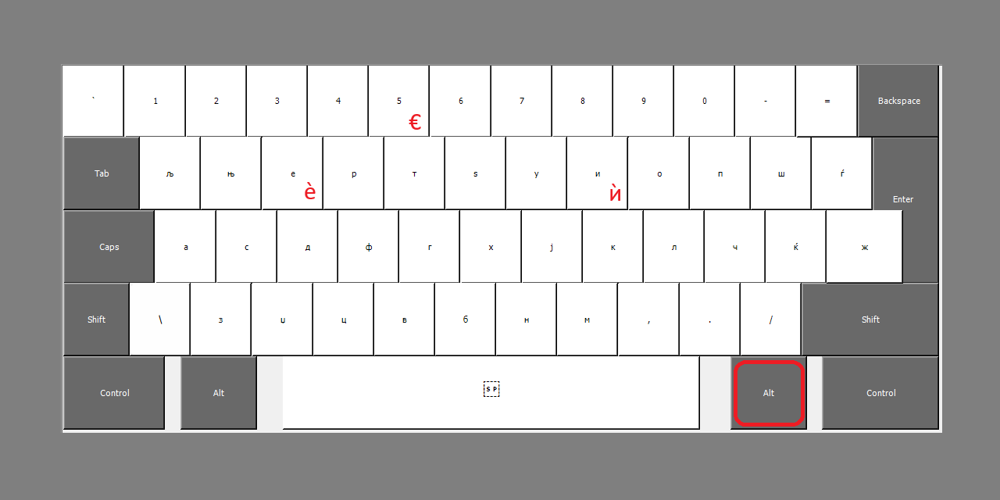
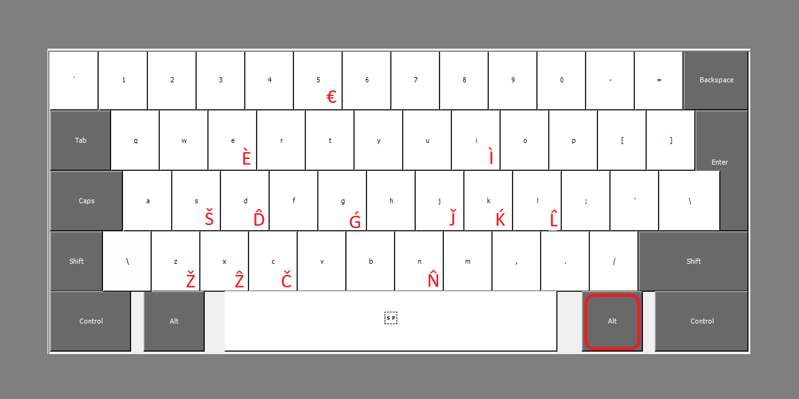

# Keyboard Layout - Macedonian - Standard со AltGr дијакритици за `И/Ѝ` и `Е/Ѐ`

Измена на стандардниот распоред на тастатурата во Microsoft Windows со додавање на дијакритиците `Ѝ` и `Ѐ`

Измени од оригиналниот распоред (layout):
- Поправка на „Undo“ функцијата со `Ctrl+Z`
  - Замена на виртуелното копче `VK_Y` со `VK_Z` и обратно бидејќи виртуелниот код на `Ѕ (кирилица)` е `VK_Z`). Причина за тоа е дека стандардната македонска тастатура е базирана на QWERTZ layout
- `Ѐ` додадена како `AltGr+E`
- `Ѝ` додадена како `AltGr+I`
- `€` додаден како `AltGr+5`
- `` ` `` и `~` вратени на нивното копче (над `Tab`, лево од `1`)
- `_ (долна црта)` вратена на `Shift+-`
- `\` и `|` вратени на копчето каде `Ѐ` беше поставена (десно од левиот `Shift`) (во Македонија ретко го има ова копче и овој тип на распоред на тастатура)

> **`AltGr` е десниот `Alt` од `Space` или `Alt+Ctrl`**

<picture>
    
</picture>

## Македонска латинична програмерска тастатура - Macedonian (Latin) - Programmers Layout

Македонска латинична програмерска тастатура (Macedonian (Latin) - Programmers) базирана на стандардниот US QWERTY layout
- Со `AltGr` ги има дијакритиците `È`, `Ì`, `Š`, `D̂`, `Ǵ`, `J̌`, `Ḱ`, `L̂`, `Ž`, `Č`, `N̂` и `Ẑ` на соодветните букви (пример со `AltGr+S` се добива `Š`)
- `Ẑ` со `AltGr+X`
- `€` со `AltGr+5`
- Дијакритиците се базирани според [ISO 9 стандардот](https://mk.wikipedia.org/wiki/Транслитерација_на_македонското_писмо)
- Инспирирана од [полската верзија](https://kbdlayout.info/KBDPL1/)

<picture>
    
</picture>

---

## Инсталирање

1. Преземете ја **[кириличната верзија](https://github.com/KKire/mk-keyboard-layout/releases/download/download/keyboard-mk-diacritics.zip)** и/или **[латиничната верзија](https://github.com/KKire/mk-keyboard-layout/releases/download/download/keyboard-mk-latin.zip)**
2. Отворете ја датотеката или екстрахирајте ја
3. Двоен-клик на `setup.exe` и прифатете административни дозволи
4. **ЗАДОЛЖИТЕЛНО** рестартирајте го компјутерот за целосно да се додаде новиот распоред (layout), во спротивно може да имате проблеми со функцијата за префрлање на јазикот (crashing)
5. Изборно:
    - Отстранете го претходниот распоред (Macedonian - Standard ЉЊЕРТЅ) за да немате дупликат на македонски распоред на тастатурата (ако сте имале македонски внес претходно)
    - Отстранете го претходниот распоред (English (US) - US) за да немате дупликат на англиски распоред на тастатурата (ако сте ја инсталирале и латиничната верзија)
6. Изборно: Инсталирајте го [language-indicator](https://github.com/yakunins/language-indicator) (препорачано да го преземете преку зеленото копче `Code ➡️ Download ZIP`)
<picture>
    
</picture>

## Деинсталирање

1. Одете во „Инсталирани апликации“ (Apps and Features)
2. Пребарајте „Macedonian - Standard - AltGr Diacritics“, „Macedonian (Latin) - Programmers“ и/или „Macedonian (Latin) - Standard“
3. Кликнете на „Деинсталирај“ (Uninstall)

---

# Keyboard Layout - Macedonian - Standard with AltGr Diacritics for `I/Ì (И/Ѝ)` and `E/È (Е/Ѐ)`
Modification of the default keyboard layout in Microsoft Windows by adding the diacritics `Ѐ` and `Ѝ`

Changes from the original layout:
- Fix "Undo" function with `Ctrl+Z`
  - Replacing the virtual key `VK_Y` with `VK_Z` and vice versa because the virtual code of `Ѕ (Cyrillic Dze)` is `VK_Z`). The reason for that is that the standard Macedonian keyboard is based on the QWERTZ layout
- `Ѐ` added as `AltGr+E`
- `Ѝ` added as `AltGr+I`
- `€` added as `AltGr+5`
- `` ` `` and `~` returned to their button (above `Tab`, left of `1`)
- `_ (underscore)` reverted to `Shift+-`
- `\` and `|` returned to the key where `Ѐ` was placed (to the right of the left `Shift`) (in Macedonia this key and this type of keyboard layout is rare)

> **`AltGr` is the right `Alt` of `Space` or `Alt+Ctrl`**

<picture>
 
</picture>

## Macedonian Latin programmer keyboard - Macedonian (Latin) - Programmers Layout

Macedonian Latin programmer keyboard (Macedonian (Latin) - Programmers) based on the standard US QWERTY layout
- With `AltGr` there are diacritics for `È`, `Ì`, `Š`, `D̂`, `Ǵ`, `J̌`, `Ḱ`, `L̂`, `Ž`, `Č`, `N̂ ` and `Ẑ` on the corresponding letters (for example with `AltGr+S` you get `Š`)
- `Ẑ` with `AltGr+X`
- `€` with `AltGr+5`
- Diacritics are based on [ISO 9 standard](https://en.wikipedia.org/wiki/Romanization_of_Macedonian)
- Inspired by the [Polish version](https://kbdlayout.info/KBDPL1/)

<picture>
 
</picture>

---

## Installing

1. Download **[Cyrillic version](https://github.com/KKire/mk-keyboard-layout/releases/download/download/keyboard-mk-diacritics.zip)** and/or **[Latin version](https://github.com/KKire/mk-keyboard-layout/releases/download/download/keyboard-mk-latin.zip)**
2. Open the file or extract it
3. Double-click `setup.exe` and accept administrative permissions
4. You **MUST** restart your computer to fully add the new layout, otherwise you may have problems with the language switching function (crashing)
5. Optional:
    - Remove the previous layout (Macedonian - Standard ЉЊЕРТЅ) so you don't have a duplicate Macedonian keyboard layout (if you had Macedonian input before)
    - Remove the previous layout (English (US) - US) so you don't have a duplicate English keyboard layout (if you also installed the Latin version)
6. Optional: Install [language-indicator](https://github.com/yakunins/language-indicator) (recommended to download from `Code ➡️ Download ZIP`)
<picture>
    
</picture>

## Uninstalling

1. Go to "Installed applications" (Apps and Features)
2. Search for "Macedonian - Standard - AltGr Diacritics", "Macedonian (Latin) - Programmers" and/or "Macedonian (Latin) - Standard"
3. Click "Uninstall"

---

### Technical information

Layouts are installed in `C:\Windows\System32` and in the registry in `HKLM\SYSTEM\CurrentControlSet\Control\Keyboard Layouts`
- `kbdmacsd.dll` - Macedonian > Macedonian - Standard - AltGr Diacritics
- `kbdmaclp.dll` - English (United States) > Macedonian (Latin) - Programmers

The corresponding `.klc` file is included in the `.zip` file of the keyboard layout

---

Made by ❤️ with [Microsoft Keyboard Layout Creator (MSKLC)](https://www.microsoft.com/en-us/download/details.aspx?id=102134)
